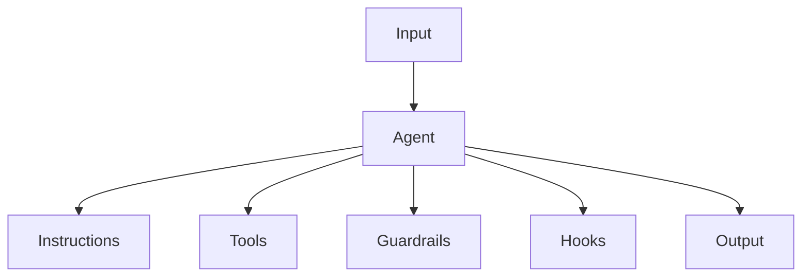

### Agent design foundations
#### 智能体设计基础

In its most fundamental form, an agent consists of three core components:

智能体最基本的形式由三个核心组件组成：

| 01 | Model | The LLM powering the agent’s reasoning and decision-making |
| --- | --- | --- |
| 01 | 模型 | 为智能体的推理和决策提供动力的大语言模型 |
| 02 | Tools | External functions or APIs the agent can use to take action |
| --- | --- | --- |
| 02 | 工具 | 智能体可用于采取行动的外部函数或应用程序编程接口 |
| 03 | Instructions | Explicit guidelines and guardrails defining how the agent behaves |
| --- | --- | --- |
| 03 | 指令 | 定义智能体行为的明确指南和约束机制 |

Here’s what this looks like in code when using OpenAI’s Agents SDK. You can also implement the same concepts using your preferred library or building directly from scratch.

这是使用OpenAI的智能体软件开发工具包（SDK）时的代码示例。你也可以使用自己喜欢的库，或者直接从头开始实现这些概念。
```python
weather_agent = Agent(
    name="Weather agent",
    instructions="You are a helpful agent who can talk to users about the weather.",
    tools=[get_weather],
)
```
### Selecting your models
#### 选择模型

Different models have different strengths and tradeoffs related to task complexity, latency, and cost. As we’ll see in the next section on Orchestration, you might want to consider using a variety of models for different tasks in the workflow.

不同的模型在任务复杂性、延迟和成本方面各有优势和权衡。正如我们将在下一节 “编排” 中看到的，你可能需要考虑在工作流程的不同任务中使用多种模型。

Not every task requires the smartest model - a simple retrieval or intent classification task may be handled by a smaller, faster model, while harder tasks like deciding whether to approve a refund may benefit from a more capable model.

并非每个任务都需要最强大的模型。简单的检索或意图分类任务可以由较小、速度更快的模型处理，而像决定是否批准退款这样更复杂的任务，可能使用能力更强的模型会更有帮助 。

An approach that works well is to build your agent prototype with the most capable model for every task to establish a performance baseline. From there, try swapping in smaller models to see if they still achieve acceptable results. This way, you don’t prematurely limit the agent’s abilities, and you can diagnose where smaller models succeed or fail.

一种有效的方法是，在构建智能体原型时，为每个任务使用能力最强的模型来建立性能基线。然后，尝试换用较小的模型，看看它们是否仍能取得可接受的结果。这样，你就不会过早限制智能体的能力，还可以分析较小的模型在哪些方面成功或失败。

In summary, the principles for choosing a model are simple:

总之，选择模型的原则很简单：

01. Set up evals to establish a performance baseline

01. 进行评估以建立性能基线

02. Focus on meeting your accuracy target with the best models available

02. 专注于使用现有最佳模型达到你的准确率目标

03. Optimize for cost and latency by replacing larger models with smaller ones where possible

03. 尽可能用较小的模型替换较大的模型，以优化成本和延迟


You can find a comprehensive guide to selecting OpenAI models here.

你可以在此处找到选择OpenAI模型的全面指南。


### Defining tools

#### 定义工具

Tools extend your agent’s capabilities by using APIs from underlying applications or systems. For legacy systems without APIs, agents can rely on computer-use models to interact directly with those applications and systems through web and application UIs - just as a human would.

工具通过使用底层应用程序或系统的应用程序编程接口（API）来扩展智能体的能力。对于没有API的遗留系统，智能体可以依靠计算机使用模型，通过网络和应用程序的用户界面直接与这些应用程序和系统进行交互，就像人类操作一样。


Each tool should have a standardized definition, enabling flexible, many-to-many relationships between tools and agents. Well-documented, thoroughly tested, and reusable tools improve discoverability, simplify version management, and prevent redundant definitions.

每个工具都应该有一个标准化的定义，以便在工具和智能体之间建立灵活的多对多关系。有详细文档记录、经过充分测试且可复用的工具，能够提高工具的可发现性，简化版本管理，并避免重复定义。


Broadly speaking, agents need three types of tools:

一般来说，智能体需要三种类型的工具：

- Orchestration

- 编排工具

- Agents themselves can serve as tools for other agents - see the Manager Pattern in the Orchestration section.

- 智能体本身可以作为其他智能体的工具 —— 详见 “编排” 部分的管理者模式。

- Refund agent, Research agent, Writing agent.

- 退款智能体、研究智能体、写作智能体。


以下是表格的英文原文和中文翻译：


| **Type** | **Description** | **Examples** |
|---|---|---|
| Data | Enable agents to retrieve context and information necessary for executing the workflow. | Query transaction databases or systems like CRMs, read PDF documents, or search the web. |
| 数据 | 使代理能够检索执行工作流所需的上下文和信息。 | 查询交易数据库或类似CRM的系统，阅读PDF文档或搜索网页。 |
| Action | Enable agents to interact with systems to take actions such as adding new information to databases, updating records, or sending messages. | Send emails and texts, update a CRM record, hand-off a customer service ticket to a human. |
| 操作 | 使代理能够与系统交互以采取行动，例如向数据库添加新信息、更新记录或发送消息。 | 发送电子邮件和短信，更新CRM记录，将客户服务工单转交给人工。 |
| Orchestration | Agents themselves can serve as tools for other agents—see the Manager Pattern in the Orchestration section. | Refund agent, Research agent, Writing agent. |
| 编排 | 代理本身可以作为其他代理的工具——参见编排部分中的管理器模式。 | 退款代理、研究代理、写作代理。 |


For example, here’s how you would equip the agent defined above with a series of tools when using the Agents SDK:

例如，以下是使用智能体软件开发工具包（SDK）为上述定义的智能体配备一系列工具的方法：

```python
from agents import Agent, WebSearchTool, function_tool


@function_tool
def save_results(output):
    db.insert({"output": output, "timestamp": datetime.time()})
    return "File saved"


search_agent = Agent(
    name="Search agent",
    instructions="Help the user search the internet and save results if asked.",
    tools=[WebSearchTool(), save_results],
)
```

As the number of required tools increases, consider splitting tasks across multiple agents (see Orchestration).

随着所需工具数量的增加，可以考虑将任务分配给多个智能体（详见 “编排” 部分）。


### Configuring instructions

#### 配置指令

High-quality instructions are essential for any LLM-powered app, but especially critical for agents. Clear instructions reduce ambiguity and improve agent decision-making, resulting in smoother workflow execution and fewer errors.

高质量的指令对于任何由大语言模型驱动的应用程序都至关重要，对于智能体来说更是如此。清晰的指令可以减少歧义，改善智能体的决策，从而使工作流程执行更顺畅，错误更少。

| Use existing documents | When creating routines, use existing operating procedures, support scripts, or policy documents to create LLM-friendly routines. In customer service for example, routines can roughly map to individual articles in your knowledge base. |
| --- | --- |
| 使用现有文档 | 在创建流程时，利用现有的操作程序、支持脚本或政策文档来创建适合大语言模型的流程。例如在客户服务中，流程大致可以对应知识库中的单个文章。 |
| Prompt agents to break down tasks | Providing smaller, clearer steps from dense resources helps minimize ambiguity and helps the model better follow instructions. |
| --- | --- |
| 促使智能体分解任务 | 从繁杂的资源中提供更小、更清晰的步骤，有助于减少歧义，帮助模型更好地遵循指令。 |
| Define clear actions | Make sure every step in your routine corresponds to a specific action or output. For example, a step might instruct the agent to ask the user for their order number or to call an API to retrieve account details. Being explicit about the action (and even the wording of a user-facing message) leaves less room for errors in interpretation. |
| --- | --- |
| 定义明确的行动 | 确保你的流程中的每一步都对应一个特定的行动或输出。例如，某一步骤可能指示智能体向用户询问订单号，或者调用API来获取账户详细信息。明确行动（甚至是面向用户消息的措辞）可以减少解释错误的空间。 |
| Capture edge cases | Real-world interactions often create decision points such as how to proceed when a user provides incomplete information or asks an unexpected question. A robust routine anticipates common variations and includes instructions on how to handle them with conditional steps or branches such as an alternative step if a required piece of info is missing. |
| --- | --- |
| 涵盖边缘情况 | 现实世界的交互常常会产生决策点，比如当用户提供不完整信息或提出意外问题时该如何处理。一个完善的流程会预见到常见的变化，并包含如何通过条件步骤或分支来处理这些情况的指令，例如在缺少必要信息时采取替代步骤。 |

You can use advanced models, like o1 or o3-mini, to automatically generate instructions from existing documents. Here’s a sample prompt illustrating this approach:

你可以使用像o1或o3-mini这样的先进模型，从现有文档中自动生成指令。以下是一个说明这种方法的示例提示：

```
“You are an expert in writing instructions for an LLM agent. Convert the following help center document into a clear set of instructions, written in a numbered list. The document will be a policy followed by an LLM. Ensure that there is no ambiguity, and that the instructions are written as directions for an agent. The help center document to convert is the following {{help_center_doc}}” 
```

### Orchestration
#### 编排
With the foundational components in place, you can consider orchestration patterns to enable your agent to execute workflows effectively.

在基础组件就位后，你可以考虑编排模式，以使你的智能体能够有效地执行工作流程。

While it’s tempting to immediately build a fully autonomous agent with complex architecture, customers typically achieve greater success with an incremental approach. 

虽然立即构建一个具有复杂架构的完全自主智能体很有吸引力，但客户通常采用渐进式方法会取得更大的成功。

In general, orchestration patterns fall into two categories:

一般来说，编排模式分为两类：

01. Single-agent systems, where a single model equipped with appropriate tools and instructions executes workflows in a loop

01. 单智能体系统，由单个配备了适当工具和指令的模型循环执行工作流程

02. Multi-agent systems, where workflow execution is distributed across multiple coordinated agents

02. 多智能体系统，工作流程的执行分布在多个协同的智能体之间


Let’s explore each pattern in detail.

让我们详细探讨每种模式。

### Single-agent systems

#### 单智能体系统

A single agent can handle many tasks by incrementally adding tools, keeping complexity manageable and simplifying evaluation and maintenance. Each new tool expands its capabilities without prematurely forcing you to orchestrate multiple agents.

单个智能体可以通过逐步添加工具来处理许多任务，使复杂性易于管理，并简化评估和维护工作。每个新工具都能扩展其能力，而无需过早地协调多个智能体。



Every orchestration approach needs the concept of a ‘run’, typically implemented as a loop that lets agents operate until an exit condition is reached. Common exit conditions include tool calls, a certain structured output, errors, or reaching a maximum number of turns.

每种编排方法都需要 “运行” 的概念，通常实现为一个循环，让智能体持续运行，直到达到退出条件。常见的退出条件包括工具调用、特定的结构化输出、错误或达到最大轮数。


For example, in the Agents SDK, agents are started using the `Runner.run()` method, which loops over the LLM until either:

例如，在智能体软件开发工具包（SDK）中，使用`Runner.run()`方法启动智能体，该方法会对大语言模型进行循环，直到满足以下任一条件：

01. A final-output tool is invoked, defined by a specific output type

01. 调用了由特定输出类型定义的最终输出工具

02. The model returns a response without any tool calls (e.g., a direct user message)

02. 模型返回一个没有任何工具调用的响应（例如，直接的用户消息）


Example usage:

使用示例：
```python

Agents.run(agent, [UserMessage("What's the capital of the USA?")])
```
This concept of a while loop is central to the functioning of an agent. In multi-agent systems, as you’ll see next, you can have a sequence of tool calls and handoffs between agents but allow the model to run multiple steps until an exit condition is met.

这种while循环的概念是智能体功能的核心。在下文中你将看到，在多智能体系统中，可以有一系列的工具调用和智能体之间的交接，但会让模型运行多个步骤，直到满足退出条件。

An effective strategy for managing complexity without switching to a multi-agent framework is to use prompt templates. Rather than maintaining numerous individual prompts for distinct use cases, use a single flexible base prompt that accepts policy variables. This template approach adapts easily to various contexts, significantly simplifying maintenance and evaluation. As new use cases arise, you can update variables rather than rewriting entire workflows.

在不切换到多智能体框架的情况下管理复杂性的一种有效策略是使用提示模板。与其为不同的用例维护大量单独的提示，不如使用一个灵活的基础提示，接受策略变量。这种模板方法可以轻松适应各种上下文，显著简化维护和评估工作。随着新用例的出现，你可以更新变量，而无需重写整个工作流程。

```
“You are a call center agent. You are interacting with {{user_first_name}} who has been a member for {{user_tenure}}. The user's most common complains are about {{user_complaint_categories}}. Greet the user, thank them for being a loyal customer, and answer any questions the user may have!”
```
### When to consider creating multiple agents

#### 何时考虑创建多个智能体

Our general recommendation is to maximize a single agent’s capabilities first. More agents can provide intuitive separation of concepts, but can introduce additional complexity and overhead, so often a single agent with tools is sufficient. 

我们的一般建议是首先最大化单个智能体的能力。更多的智能体可以直观地分离不同概念，但也会引入额外的复杂性和开销，所以通常一个配备工具的单个智能体就足够了。


For many complex workflows, splitting up prompts and tools across multiple agents allows for improved performance and scalability. When your agents fail to follow complicated instructions or consistently select incorrect tools, you may need to further divide your system and introduce more distinct agents.

对于许多复杂的工作流程，将提示和工具分配给多个智能体可以提高性能和可扩展性。当你的智能体无法遵循复杂的指令，或者一直选择错误的工具时，你可能需要进一步拆分系统，引入更多不同的智能体。


Practical guidelines for splitting agents include:

拆分智能体的实用指南包括：

| Complex logic | When prompts contain many conditional statements (multiple if-then-else branches), and prompt templates get difficult to scale, consider dividing each logical segment across separate agents. |
| --- | --- |
| 复杂逻辑 | 当提示包含许多条件语句（多个if-then-else分支），并且提示模板难以扩展时，可以考虑将每个逻辑段分配给不同的智能体。 |
| Tool overload | The issue isn’t solely the number of tools, but their similarity or overlap. Some implementations successfully manage more than 15 well-defined, distinct tools while others struggle with fewer than 10 overlapping tools. Use multiple agents if improving tool clarity by providing descriptive names, clear parameters, and detailed descriptions doesn’t improve performance. |
| --- | --- |
| 工具过载 | 问题不仅仅在于工具的数量，还在于它们的相似性或重叠性。有些实现可以成功管理15个以上定义明确、各不相同的工具，而有些则在管理不到10个重叠工具时就遇到困难。如果通过提供描述性名称、明确的参数和详细的说明来提高工具的清晰度，但仍无法提高性能，那就使用多个智能体。 |

### Multi-agent systems

#### 多智能体系统

While multi-agent systems can be designed in numerous ways for specific workflows and requirements, our experience with customers highlights two broadly applicable categories:

虽然多智能体系统可以根据特定的工作流程和需求以多种方式进行设计，但我们与客户合作的经验突出了两种广泛适用的类型：

| Manager (agents as tools) | A central “manager” agent coordinates multiple specialized agents via tool calls, each handling a specific task or domain. |
| --- | --- |
| 管理者（智能体作为工具） | 一个中央 “管理者” 智能体通过工具调用协调多个专门的智能体，每个智能体处理特定的任务或领域。 |
| Decentralized (agents handing off to agents) | Multiple agents operate as peers, handing off tasks to one another based on their specializations. |
| --- | --- |
| 去中心化（智能体之间交接任务） | 多个智能体以对等的方式运行，根据各自的专长相互交接任务。 |

Multi-agent systems can be modeled as graphs, with agents represented as nodes. In the manager pattern, edges represent tool calls whereas in the decentralized pattern, edges represent handoffs that transfer execution between agents.

多智能体系统可以建模为图，其中智能体表示为节点。在管理者模式中，边表示工具调用；而在去中心化模式中，边表示在智能体之间转移执行权的交接。

Regardless of the orchestration pattern, the same principles apply: keep components flexible, composable, and driven by clear, well-structured prompts.

无论采用哪种编排模式，都遵循相同的原则：保持组件的灵活性、可组合性，并由清晰、结构良好的提示驱动。

### Manager pattern
#### 管理者模式
The manager pattern empowers a central LLM - the “manager” - to orchestrate a network of specialized agents seamlessly through tool calls. Instead of losing context or control, the manager intelligently delegates tasks to the right agent at the right time, effortlessly synthesizing the results into a cohesive interaction. This ensures a smooth, unified user experience, with specialized capabilities always available on-demand.

管理者模式使一个中央大语言模型（即 “管理者”）能够通过工具调用无缝协调一组专门的智能体。管理者不会丢失上下文或控制权，而是在正确的时间将任务智能地委派给合适的智能体，并轻松地将结果整合为连贯的交互。这确保了流畅、统一的用户体验，用户可以随时按需使用专门的功能。

This pattern is ideal for workflows where you only want one agent to control workflow execution and have access to the user.

这种模式非常适合那些你只希望一个智能体控制工作流程执行并与用户交互的工作场景。


